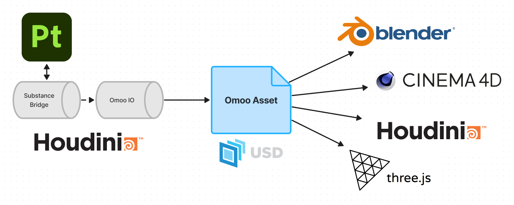

# OmooAsset

USD based 3D model storage solution, our goal is **"create once, render anywhere"**.

Currently supported platforms:

- Houdini 20
- Blender 4.x
- Cinema4D 2024.x (Redshift)
- Threejs (.glb)

[中文文档](https://uj6xfhbzp0.feishu.cn/wiki/L7dVwVfP7iffHskjHL0cjCaqnfc?from=from_copylink)

# Why OmooAsset ?

It is reasonable to assume that as long as the platform has full support for USD | MaterialX, all models can be loaded consistently. It is conceivable that eventually all platforms will highly support for reading and writing USD | MaterialX, but it is still conceivable that the definition of channels for rendering will not be completely consistent. For example, some renderers support the effect of model scaling on displacement strength, while others do not. **This is a problem that Omoo Asset is trying to solve by making sure that models are "rendered" consistently across all renderers.**

We have defined a subset of MaterialX, [OmooLab Standard Surface (OSS Material)](docs/OmooLab_Standard_Surface.md), which is unique in that the material parameters are almost entirely controlled by textures. Just like USD can only store pure geometry, not controllers and modifiers, all physical properties of the material are baked and calculated into textures.

Omoo Asset is exported via Houdini's Omoo Export SOP. For principled shader it is converted to a USD Preview Surface (a Houdini native feature), so in any case, all materialas in Omoo Assert include at least USD Preview Surface, which ensures that the Omoo Asset can be loaded as a .usd with all materials' textures, even without any plugins. We also provide plug-ins for each platform to ensure maximum consistency in material rendering:

- [Blender 4.x](docs/Blender.md)
- [Cinema4D 2024.x (Redshift)](docs/Cinema4D.md)

If you just want to import Omoo Assets, you can click the links above.

# Getting Started

## Houdini HDA Installation

1. Download the latest release version of OmooAsset. [https://github.com/OmooLab/OmooAsset/releases](https://github.com/OmooLab/OmooAsset/releases)

2. Unzip all files to any directory. e.g. `path/to/OmooAsset`

3. Reference it's package path to houdini package json file `houdiniX.Y/packages/env.json`.

```json
{
  "package_path": ["path/to/OmooAsset/packages"]
}
```

# Omoo Asset Sturcture

### Directory Sturcture

```bash
<AssetName>
|-- Components # Layers, textures, any other files
|   |-- Clips # Optional
|   |-- Textures # Optional
|   |-- <AssetName>.geometries.usd
|   |-- <AssetName>.materials.usd # Optional
|   `-- <AssetName>_payload.usd
`-- <AssetName>.usd # Main file
```

### USD Prim Path Sturcture

Note that the Omoo Asset is not used to store the scene, just models, so there will only be one Asset (Component) in each omoo asset.

```bash
<AssetName> # Xform (Component)
|-- Geometries # Scope
|   |-- <Mesh_1> # Mesh
|   |   `-- <Material_1_group> # GeomSubset
|   |-- <Mesh_2> # Mesh
|   `-- <Mesh_3> # Mesh
|-- Materials # Scope (optional)
|   `-- <Material_1> # Material
```