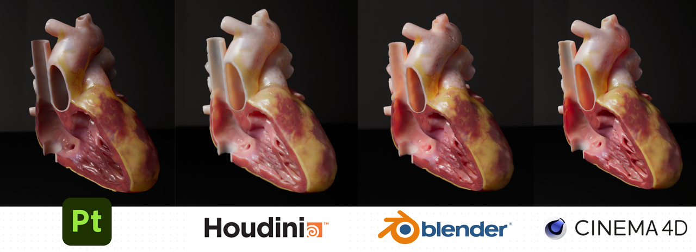

[中文文档](https://uj6xfhbzp0.feishu.cn/wiki/L7dVwVfP7iffHskjHL0cjCaqnfc?from=from_copylink)


# Omoo Asset

USD based 3D model storage solution, our goal is **"create once, render anywhere"**.
If you're struggling to keep your model assets rendering consistently on different platforms by repeatedly creating material spheres manually, and Houdini is in your workflow, then Omoo Asset is the best choice!

Currently supported platforms:

- Houdini 20
- Blender 4.x
- Cinema4D 2024.x (Redshift)
- Threejs (.glb)

Future supported platforms:

- Unreal
- Unity

# Why Omoo Asset ?

Theoretically, as long as the platform can fully support USD | MaterialX, it can ensure consistency itself. However, materials and channel definitions are difficult to standardize across platforms and are unlikely to be resolved in the short term. For example, some renderers support the effect of model scaling on displacement strength, while others do not. This is a problem that Omoo Asset wants to solve, to maximize the consistency of the rendering result, especially the subsurface scattering.



The image above shows the rendering results of Omoo Asset on different renderers, from the real-time preview in Substance 3D Painter at the material texturing stage, to the rendering results in Houdini Karma at the material Lookdev stage, to the output to Blender | Cinema4D rendering. Although, the rendering results can't be said to be exactly the same 🥲, at least in terms of channel definitions and properties strength values (e.g. displacement and subsurface) are the same, the only variable being the renderer itself 👌.

So how does Omoo Asset ensure consistency?

We have defined a MaterialX specification, [OmooLab Standard Surface (OSS Material)](docs/omoolab_standard_surface.md), which is unique in that the material parameters are almost entirely controlled by the texture. Just like USD can only store pure geometry, not controllers and modifiers, all physical properties on the material are baked into the textures. OSS Material includes an output of the USD Preview Surface, which ensures that Omoo Asset can load the material texture when reading it as .usd. Of course, for optimal rendering, you'll need to use the plugins we provide.

### Known Limitations

- No support for procedural materials, material animations
- No support for Animated skeleton (will support in the future)
- Depends on how well DCC itself supports USD (will not in the future)

# Getting Started

### Configure OCIO (optional)

Consistent rendering also relies on a consistent working color space across all software, so a unified OCIO profile is recommended.We also provide a profile based on aces v1.3 ocio v2.1, adding special values defined by each of Houdini, Blender, and Substance 3D Painter to ensure maximum compatibility.
Download OmooAset_v0.1.0_OCIO.zip from https://github.com/OmooLab/OmooAsset/releases/latest. Unzip it to any location and add OCIO to the Windows environment variable with the value of the path to the config file.

### Importing Omoo Asset

- [Houdini 20](docs/houdini.md)
- [Blender 4.x](docs/blender.md)
- [Cinema4D 2024.x (Redshift)](docs/cinema4d.md)

### Exporting Omoo Asset

Currently you can only make it in Houdini, you can choose to model it in other software, but eventually you need to export it from Omoo Export SOP in Houdini. It's very easy to do, just connect Omoo Export in Sop and click Export.

If you need to paint materials, you can insert a Substance Bridge node in front of Omoo Export, which connects you to the Substance 3D Painter and allows you to quickly transfer materials back to Houdini and render them in Karma. This is also currently the only way to create OSS Materials.

Follow along with [your first Omoo Asset](docs/your_first_omoo_asset.md) to learn more about creating omoo asset!

# Omoo Asset Sturcture

### Directory Sturcture

```bash
{AssetName}
|-- Components # Layers, textures, any other files
|   |-- Clips # Optional
|   |-- Textures # Optional
|   |-- {AssetName}.geometries.usd
|   |-- {AssetName}.materials.usd # Optional
|   `-- {AssetName}_payload.usd
`-- {AssetName}.usd # Main file
```

### USD Prim Path Sturcture

Note that the Omoo Asset is not used to store the scene, just models, so there will only be one Asset (Component) in each omoo asset.

```bash
{AssetName} # Xform (Component)
|-- Geometries # Scope
|   |-- {Mesh_1} # Mesh
|   |   `-- {Material_1_group} # GeomSubset
|   |-- {Mesh_2} # Mesh
|   `-- {Mesh_3} # Mesh
|-- Materials # Scope (optional)
|   `-- {Material_1} # Material
```
