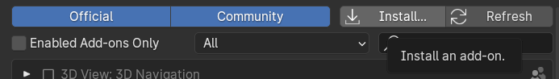
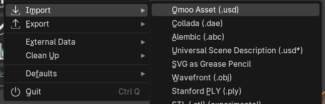

# OmooAset Blender Add-on

# Getting Start

[Configure OCIO (optional)](../README.md#configure-ocio-optional)  
[Download the Omoo Asset example (optional)](https://drive.google.com/file/d/1G_60KsiEinKOVVH-J6BQNtNL8gSb8kwX/view?usp=sharing)

### Download and install the plugin

Download the latest version of the plugin `OmooAset_v0.1.0_Blender.zip` from https://github.com/OmooLab/OmooAsset/releases/latest

Edit - Preferences... - Add-ons - Install. Select the add-on .zip file.

### Import Omoo Asset

File - Import - Omoo Asset (.usd). Select the Omoo Asset entry file (.usd)

