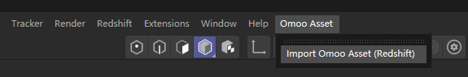

# OmooAset Cinema4D Plugin

# Getting Start

[Configure OCIO (optional)](../README.md#configure-ocio-optional)  
[Download the Omoo Asset example (optional)](https://drive.google.com/file/d/1G_60KsiEinKOVVH-J6BQNtNL8gSb8kwX/view?usp=sharing)

### Download and install the plugin

Download the latest version of the plugin `OmooAset_v0.1.0_Cinema4D.zip` from https://github.com/OmooLab/OmooAsset/releases/latest

Copy and overwrite all the folders under the zip package to `%appdata%\Maxon\{cinema4d version}`. For example `%appdata%\Maxon\Maxon Cinema 4D 2024_A5DBFF93`  
Then restart Cinema 4D.

### Import Omoo Asset

Omoo Asset - Import Omoo Asset (Redshift)

